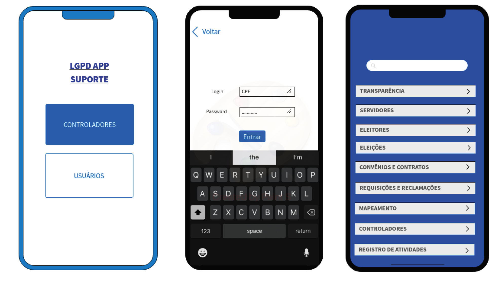

# LGPD Suporte App

Projeto da Disciplina PGIA 7310 - Fundamentos de Programação - Informática Aplicada - UFRPE

## Logotipo

## Descrição
Este é um projeto de aplicativo para oferecer suporte à implementação da LGPD. Para isso, a partir da Legislação existente, o aplicativo oferecerá uma checklist aplicável aos gestores de órgãos públicos na implementação dos requisitos da LGPD, bem como poderá servir como ferramenta de transparência e de avaliação de conformidade.

## Vídeo Simulando Navegação das Telas Iniciais
https://youtu.be/u_4525YgxTA

## Vídeo de Apresentação do Aplicativo (Pitch)
https://youtu.be/OL8kf2FTbxc

## Widget Trees Iniciais

## Telas Iniciais

## Fluxo de Atividades

